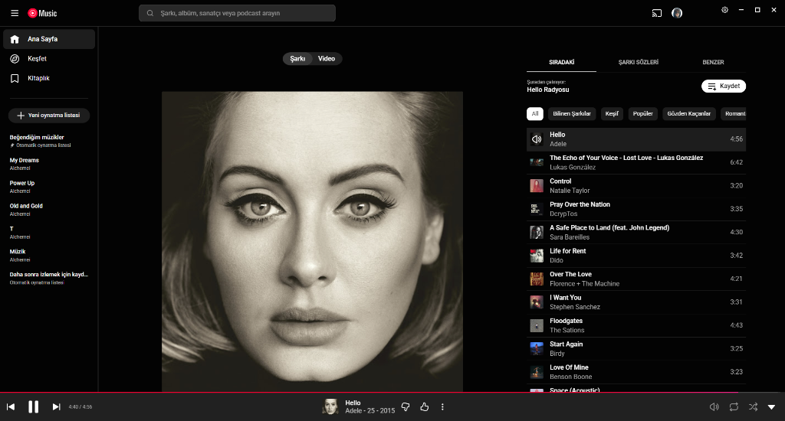

# 🎵 YouTube Music Desktop

A modern, stylish, and feature-rich YouTube Music desktop client designed specifically for Windows.





## ✨ Features

This application goes beyond the standard web experience, optimized for the desktop:

- **💎 Modern & Transparent UI:** Frameless design with Windows 11 Mica effect support.
- **🖼️ Native Window Controls:** Integrated window buttons that blend seamlessly with the YouTube Music interface.
- **🔔 System Tray Support:** 
  - Minimizes to the system tray (`X` button behavior is configurable).
  - Keeps music playing in the background.
- **🖱️ Enhanced Navigation:** Optimized for a smooth user experience with fixed clickable areas.
- **📦 Portable:** No installation required (optional), run it directly.
- **⚙️ Customizable Settings:**
  - Minimize to tray option
  - Start minimized
  - Toggle transparency effect

## 🚀 Download & Installation

You can download the latest version from the [Releases](https://github.com/Alchemei/youtube-music-desktop-app/releases) page, or use the installer provided in this repository.

### Installation
1. Navigate to the `installer` folder in this repository.
2. Download `YouTube Music Setup.exe`.
3. Run the installer to set up the application.

### Portable Usage
1. Download `YouTubeMusic-Portable-v2.zip` from releases.
2. Extract the ZIP file.
3. Run `YouTube Music.exe`.

## 🛠️ Development

If you want to contribute or run from source:

### Requirements
- [Node.js](https://nodejs.org/) (Version 18+)
- [Git](https://git-scm.com/)

### Steps

1. Clone the repository:
```bash
git clone https://github.com/Alchemei/youtube-music-desktop-app.git
cd youtube-music-desktop-app
```

2. Install dependencies:
```bash
npm install
```

3. Run in development mode:
```bash
npm start
```

4. Build the executable:
```bash
npm run package
```

## 📝 License

This project is licensed under the [MIT License](LICENSE).

---
**Developer:** [Alchemei](https://github.com/Alchemei)
